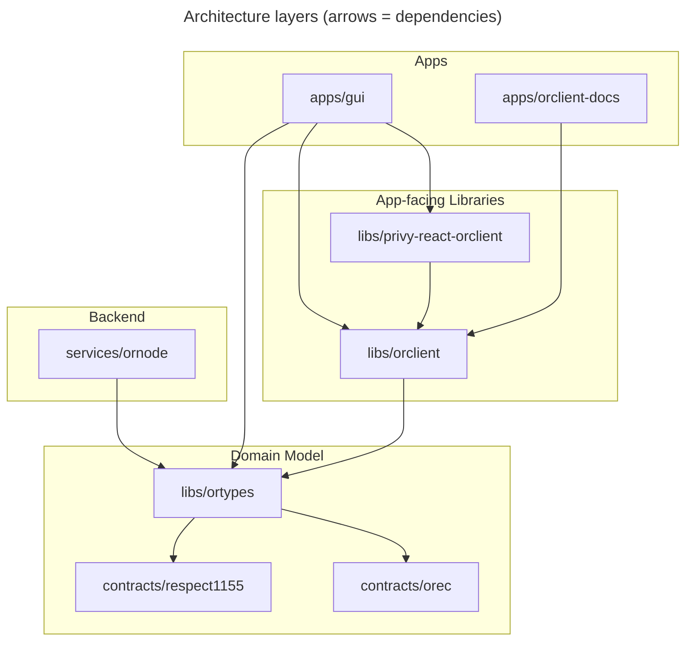

# ORDAO

ORDAO (Optimistic Respect-based DAO) is a toolset for DAOs that use a non-transferrable reputation token (Respect). It provides smart contracts, a client library, a backend service, and a frontend — everything needed to run a DAO where proposals are voted on using Respect weight and executed onchain via [OREC](./docs/OREC.md).

For understanding of design philosophy and context, start with the [OREC whitepaper](./docs/OREC.md).

## Architecture

The codebase is inspired by principles of [clean architecture](https://blog.cleancoder.com/uncle-bob/2012/08/13/the-clean-architecture.html). The smart contracts and shared type library ([ortypes](./libs/ortypes/)) form the innermost domain layer. The client library ([orclient](./libs/orclient/)) and backend service ([ornode](./services/ornode/)) depend on ortypes but not on each other or on any UI. The frontend ([gui](./apps/gui/)) sits at the outermost layer and can be swapped without affecting the rest. See the [ortypes README](./libs/ortypes/#role-in-the-architecture-of-ordao) for more detail on how this design enables code reuse, keeps contracts simple, and makes the system independent of UI and storage choices.

Only **proposal hashes are stored onchain** — full proposal content and metadata lives on the ornode. Orclient abstracts this split: it translates user inputs into contract calls, uploads proposal data to the ornode, and merges onchain + offchain data into consistent reads. See the [orclient README](./libs/orclient/#why-use-orclient) for more.

## Components

### Smart Contracts

* **[OREC](./contracts/packages/orec/)** — Optimistic Respect-based Executive Contract. Enables DAOs to execute onchain actions democratically while [avoiding voter-apathy](./docs/OREC.md#motivation) through a low quorum + veto period design.
* **[Respect1155](./contracts/packages/respect1155/)** — ERC-1155 Respect token. Non-transferrable awards (NTTs) with a denomination that sums to a fungible Respect balance.
* **[SolidRespect](./contracts/packages/solid-respect/)** — ERC-20-compatible non-transferrable Respect token where the entire distribution is fixed at deployment.

### Services

* **[ornode](./services/ornode/)** — Backend API service that stores proposal content, attachments, votes, and Respect token metadata offchain. OREC only stores proposal hashes onchain; the ornode holds the full data.

### Libraries

* **[orclient](./libs/orclient/)** — Client library for ORDAO apps. Handles proposal creation (translate → submit onchain → upload to ornode), voting, execution, and querying — abstracting the onchain/offchain split. ([Full API docs](https://orclient-docs.frapps.xyz/))
* **[ortypes](./libs/ortypes/)** — Shared domain model: TypeScript types, Zod validation schemas, and the translation layer between user inputs and contract calls. The core that all other components depend on.
* **[privy-react-orclient](./libs/privy-react-orclient/)** — React hooks and context provider for integrating orclient with [Privy](https://www.privy.io/) authentication. Includes fallback to read-only mode when no wallet is connected.

### Utility Libraries

* **[ts-utils](./libs/ts-utils/)** — Shared TypeScript utilities (serialization, object helpers, error handling).
* **[zod-utils](./libs/zod-utils/)** — Zod schema reflection and introspection utilities.
* **[ethers-decode-error](./libs/ethers-decode-error/)** — Decode ethers.js smart contract errors into human-readable messages.

### Apps

* **[gui](./apps/gui/)** — ORDAO frontend built with React, Chakra UI, and TanStack Router. Currently implements breakout-result submission and proposal management for fractals.
* **[orclient-docs](./apps/orclient-docs/)** — Generated API documentation site for orclient. ([Live](https://orclient-docs.frapps.xyz/))

### Documentation

* **[OREC whitepaper](./docs/OREC.md)** — Design and specification of the Optimistic Respect-based Executive Contract.
* **[OF2 Concept](./docs/OF2-CONCEPT.md)** — How ORDAO implements the Optimism Fractal concept.
* **[Upgrade path](./docs/OF_ORDAO_UPGRADE.md)** — Comparison with older Optimism Fractal software and the proposed upgrade path.

## ORDAO Fractal Apps

ORDAO components combine to create apps for community DAOs. Several [fractal communities](https://optimystics.io/blog/fractalhistory) are running ORDAO instances today:

| Community | ORDAO Instance | Comments |
|---|---|---|
| [Eden Fractal](https://edenfractal.com/) | [eden.frapps.xyz](https://eden.frapps.xyz/) | |
| [Optimism Fractal](https://optimismfractal.com/) | [optimism.frapps.xyz](https://optimism.frapps.xyz/) | ORDAO originated as an upgrade to Optimism Fractal's older software. See the [upgrade document](./docs/OF_ORDAO_UPGRADE.md) for a comparison and migration path. |
| [ZAO Fractal](https://www.thezao.com/) | [zao.frapps.xyz](https://zao.frapps.xyz/) | |

### Deploying Your Own

To deploy an ORDAO instance for your community, you can use the [orfrapps](https://github.com/sim31/orfrapps) repository. It provides configuration files, deployment scripts, and CLI tools for setting up and maintaining ORDAO instances for fractal communities. This repository (ordao) contains the source code and is included in orfrapps as a submodule.
