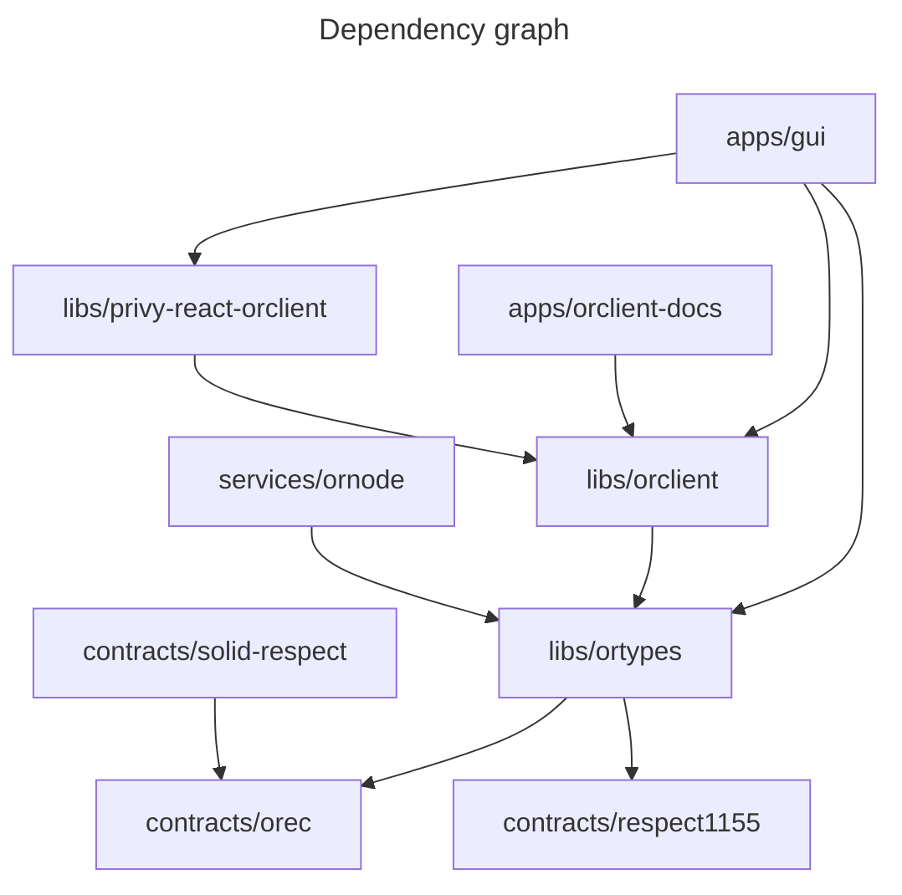

# ORDAO

ORDAO (Optimistic Respect-based DAO) is a toolset for type of DAOs which use non-transferrable reputation token (Respect).

These are the main components of ORDAO:

* [OREC (whitepaper)](./docs/OREC.md) - Optimistic Respect-based executive contract enables DAOs to execute actions onchain in a democratic way while avoiding [voter-apathy problem](./docs/OREC.md#motivation).
* [Solidity Smart Contracts](./contracts/)
  * [OREC (implementation)](./contracts/packages/orec/);
  * [Respect1155](./contracts/packages/respect1155/) - Respect token contract based on ERC-1155 standard;
  * [SolidRespect](./contracts/packages/solid-respect/) - ERC-20-compatible non-transferrable Respect token where the entire distribution is fixed at deployment
* [Services](./services/)
  * [ornode](./services/ornode/) - API service for storing OREC proposals and Respect token metadata;
* [Libraries for interfacing with OREC](./libs/)
  * [orclient](./libs/orclient/) - A library to use by Ordao apps / frontends, that abstracts all the communication with the backend and blockchain;
  * [ortypes](./libs/ortypes/) - Typescript types and helper utilities for Ordaos. Defines interfaces between orclient - ornode - contracts;
  * [privy-react-orclient](./libs/privy-react-orclient/) - Helpers for using orclient with Privy and React;
* [Utility libraries](./libs/)
  * [ts-utils](./libs/ts-utils/) - Shared Typescript utilities;
  * [zod-utils](./libs/zod-utils/) - Helper utilities for working with Zod;
  * [ethers-decode-error](./libs/ethers-decode-error/) - Decode ethers.js smart contract errors into human-readable messages;
* [Apps](./apps/)
  * [gui](./apps/gui) - ORDAO frontend (currently only breakout-result submission frontend for fractals is implemented);
  * [orclient-docs](./apps/orclient-docs/) - API documentation for [orclient](./libs/orclient/); 
* [Docs](./docs/) - documentation;

For understanding of design philosophy and context you will want to start with reading [OREC whitepaper](docs/OREC.md).

## Relationship to Optimism Fractal
ORDAO came about as an upgrade to Optimism Fractal. [Here](./docs/OF_ORDAO_UPGRADE.md) you can find comparison with older Optimism Fractal software and proposed upgrade path.
