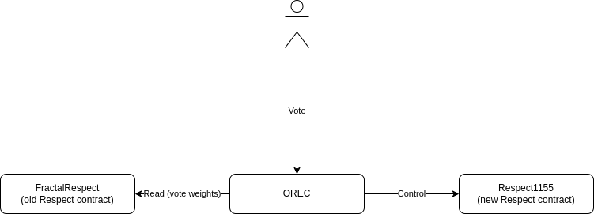

# ORDAO Smart Contracts

Smart contracts for Optimistic Respect-based DAOs.

* [Orec](./orec/) - Optimistic Respect-based Executive Contract. Enables a DAO to execute onchain actions through a proposal/vote/veto/execute lifecycle, using a non-transferrable Respect token for vote weighting. See the [OREC whitepaper](../../docs/OREC.md) for the full specification.
* [Respect1155](./respect1155/) - Non-transferrable Respect token contract based on ERC-1155. Each award is an SBT (soulbound token) with an associated value; fungible Respect balance is the sum of all SBT values an account holds. Intended to be owned by OREC for Respect distribution.
* [SolidRespect](./solid-respect/) - ERC-20-compatible non-transferrable Respect token where the entire distribution is fixed at deployment. Useful for migrating an existing Respect distribution to another chain as a static snapshot.

Rationale for this design is in the [upgrade path description](../../docs/UPGRADE_PATH.md).
