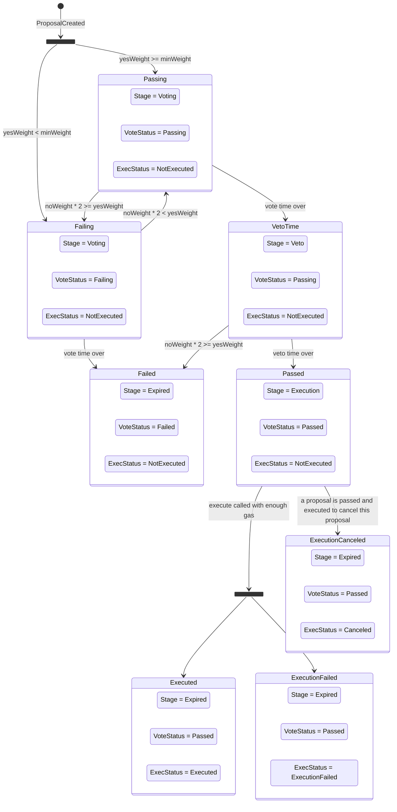

# Optimistic Respect-based Executive Contract (OREC)

This is an implementation of the [OREC concept](../../../docs/OREC.md).

## Overview

OREC enables a DAO to execute onchain transactions using an optimistic governance model weighted by a non-transferrable Respect token. A small group of contributors can propose and pass actions unless a sufficiently large opposing group vetoes them within a time window.

### Constructor Parameters

Read [OREC specification](../../../docs/OREC.md#specification) to understand full meaning of these parameters.

| Parameter | Description |
|---|---|
| `respectContract_` | Address of the Respect token contract (must support `IERC165`; either [`IRespect`](./contracts/IRespect.sol) or `ERC20` `balanceOf` interface) |
| `voteLenSeconds_` | Duration of the voting period (seconds) |
| `vetoLenSeconds_` | Duration of the veto period (seconds) |
| `minWeight_` | Minimum total yes-vote weight for a proposal to pass |
| `maxLiveYesVotes_` | Maximum number of live proposals a single account can have yes-votes on (spam protection) |

### Key Rules

- A proposal **passes** if `yesWeight >= minWeight` and `noWeight * 2 < yesWeight`.
- During the **veto period**, only no-votes are accepted. If no-votes exceed the threshold the proposal fails.
- The contract is its own `Ownable` owner, so governance parameters can only be changed through a passed proposal.

More details in [OREC whitepaper](../../../docs/OREC.md).

## Build and Test

```shell
npm run build        # compile contracts and TypeScript
npm run test         # run Hardhat tests
npm run test-gas     # run tests with gas reporting
```

## Lifecycle of Proposal



### Edge cases
There are some additional states that are possible to reach but are not very likely or useful:

#### It is possible to cancel a failed proposal

This will delete the proposal from storage, but unless it's part of some bigger execution context you're not going to save any gas;

#### It might be theoretically possible to cancel a proposal that is not yet passed or failed;

1. Construct proposal A but don't submit it onchain;
2. Submit proposal B to cancel proposal A (submit it onchain);
3. Submit proposal A;
4. Pass and execute proposal B to cancel proposal A;
Result: proposal A is canceled (removed) before it reaches execute stage.

But I don't see a vulnerability here.
